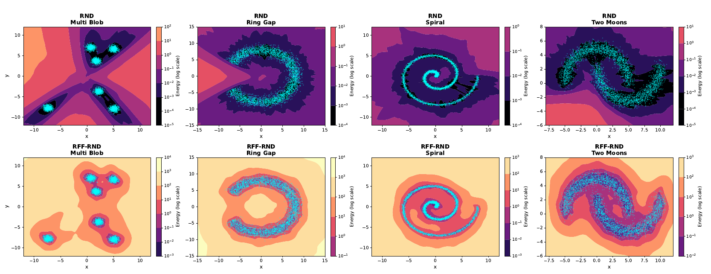

# RFF-RND

**Mitigating Overgeneralization in RND via Spectral Target Design**

NeurIPS 2026

Minseok Jeong<strong>*</strong><sup>1</sup>, Yechan Lee<strong>*</strong><sup>1</sup>, Hyewon Choi<sup>1</sup>, Jeongyong Yang<sup>2</sup>, SooJean Han<sup>1,†</sup>

<sup>1</sup> KAIST · <sup>2</sup> University of Washington

<strong>*</strong> Co-first authors

[Paper](https://openreview.net/forum?id=yYvDH6yl2q)

## Abstract

Random Network Distillation (RND) is a scalable novelty signal for RL based on a fixed random target network and a trained predictor network. However, it can overgeneralize: the predictor extrapolates the random target off the data manifold, causing novelty scores to collapse on unfamiliar inputs. This paper analyzes this failure through a kernel-theoretic lens. Under a GP target model and an NTK-regime predictor, we show that the RND novelty score is a cross-kernel residual variance: it is governed jointly by the target covariance kernel and the predictor NTK, rather than by either one alone. This identifies overgeneralization as spectral under-excitation. Motivated by this view, we formulate spectral target design as a principle for shaping RND novelty geometry. As a concrete instance, we replace the implicit random-network target with a bandwidth-controlled Random Fourier Feature (RFF) target. Empirically, this redistribution increases residual signal in modes that are less attenuated by the predictor. Experiments on offline D4RL, online Atari, and Fetch manipulation benchmarks show improved novelty discrimination and downstream RL performance.



## Structure

```text
RFF-RND/
├── README.md
├── requirements.txt
├── assets/                     # Figures
├── offline/                    # D4RL offline RL
│   ├── config/
│   ├── src/
│   └── train_offline_rl.py
└── online/                     # Atari online RL
    ├── configs/
    ├── main.py
    └── run.sh
```

## Environment setup

From the repository root (`RFF-RND/`):

```bash
conda create -n rff-rnd python=3.10 -y
conda activate rff-rnd
python -m pip install -r requirements.txt
```

Offline RL requires MuJoCo 2.1 installed and connected through `LD_LIBRARY_PATH`.

## Usage

Run from the repository root (`RFF-RND/`). Both commands read experiment settings from the specified config file; edit the config files to change the settings.

### Offline RL

Config: [`offline/config/train_default_config.yaml`](offline/config/train_default_config.yaml), which also loads the environment, algorithm, and uncertainty configs in [`offline/config/`](offline/config/).

Train on D4RL HalfCheetah:

```bash
python offline/train_offline_rl.py offline/config/train_default_config.yaml
```

### Online RL

Config: [`online/configs/config_RFF_MontezumaRevenge.conf`](online/configs/config_RFF_MontezumaRevenge.conf).

Train on Atari MontezumaRevenge:

```bash
python online/main.py online/configs/config_RFF_MontezumaRevenge.conf
```
